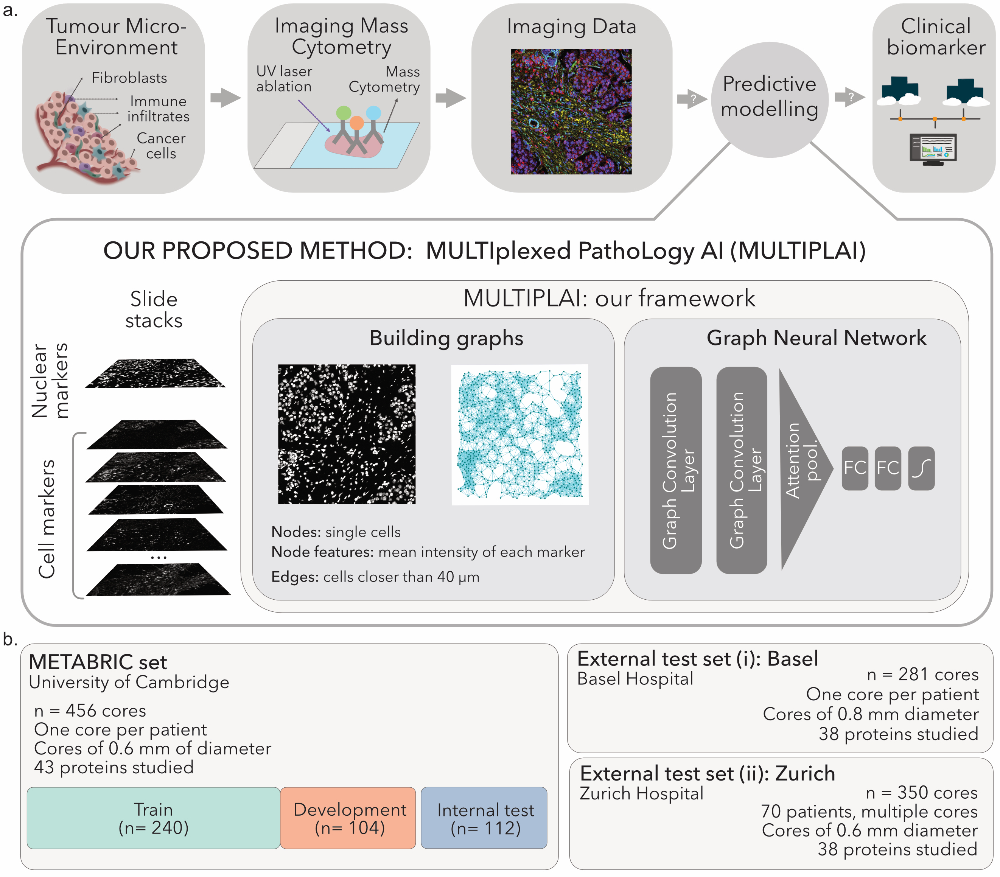

  

# MULTIPLAI: Predictive Modelling of Highly Multiplexed Tumour Tissue Images by Graph Neural Networks
This is the repository for the manuscript "Predictive Modelling of Highly Multiplexed Tumour Tissue Images by Graph Neural Networks" by Martin-Gonzalez et al.

  

In this manuscript, we present MULTIPLAI  (MULTIplexed PathoLogy AI), a novel framework to predict clinical biomarkers from highly multiplexed imaging data. The method relies on attention-based graph neural networks that integrate both the phenotypic and spatial dimensions, capturing Tumour MicroEnvironment Differences. For this proof- of-concept study, we used MULTIPLAI to predict oestrogen receptor status, a key clinical variable for breast cancer patients, from Imaging Mass Cytometry (IMC). 

The preprint can be accessed here:

## DATA USED:

The data used for this analysis is publicly available and can be downloaded from their respective publications:

- [METABRIC (used for train, development and internal test set)](https://www.nature.com/articles/s43018-020-0026-6)
- [BASEL AND ZURICH COHORTS (used for external test sets)](https://www.nature.com/articles/s41586-019-1876-x)
  

## LIBRARIES NEEDED:

For training the geometric deep learning models, we used [Pytorch](https://pytorch.org) (version 1.5.1) and [Deep Graph Library](https://www.dgl.ai) (version 0.4.3) with CUDA 10.2. 

## THE REPOSITORY:

This repository is organised as follows:

1. **Building graphs:** this is the jupyter notebook to build the graphs from IMC images as described in section 2.1 of the manuscript and to perform the different strategies for scaling the data as described in section 4.3 of the manuscript.
   - The "single_cell_data.csv", "Basel.csv" and "Zurich.csv" make reference to the files from each of the public repositories mentioned above. **They need to be downloaded from their respective repositories (i.e. they are not provided or maintained by us)**
2. **Finding the best architecture**: jupyter notebook to extract the results presented in section 4.2 of the manuscript. Folder "code" contains the code to run the different models.
   - Sub-folder *results* for each architecture and each combination of hyperparameters as described in section 4.2 of the manuscript. 
3. **Validating the best architecture**: The trained best architecture from section 4.2 is provided as well as the code for validating the results under different pre-processing conditions as presented in section 4.3 of the manuscript.

Inputs are provided here due to their large size: https://drive.google.com/drive/folders/1uZ3Ys7uR5SOukBwzOTNu4GRCIsawqyUx?usp=sharing
   - The resulting graphs are provided together with the raw supercell features and the two preprocessing strategies described in the manuscript. 
   - Train, development and internal test set splits used for this study are provided. 
  
**Although we tried to seed everything, pytorch doesn't allow everything to be seed so please expect some variability on the actual numbers**. The codes and results provided here are the ones we used for our analysis reported in the manuscript.
